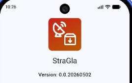
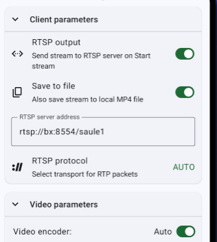
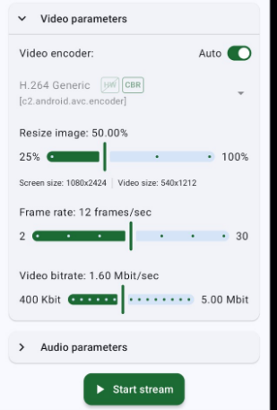

# StraGla

[Download StraGla.apk 3.3MB 2026-05-02](https://github.com/Aivars19/StraGla/releases/download/v0.0.1beta/StraGla-0.0.1beta-release.apk)

StraGla ir "ekrāna straumēšana + saglabāšana" aplikācija. 
Pilnā projekta lapa: [github.io/Aivars19/StraGla]. 

Dara to pašu ko [ScreenStream](https://play.google.com/store/apps/details?id=info.dvkr.screenstream), bet ar uzlabojumiem. 

Ko dara:
- straumē uz rtsp/rtsps adresi
- saglabā mp4 ekrāna ierakstu uz iekārtas
- nepātrauc straumēt pie tīkla kļūdām (atjauno straumi, kad tīkls atgriežas)

Salīdznot ar Screenstream:
- noņemtas telemtrijas sūtīšana, reklāmas
- noņemta liekā funkconalitāte (mpeg režīms, webrtc režīms)
- uzlabots interfeiss - regulējošie parametri ir ar sakarīgiem soļiem. 

## Aplikācijas bildes

